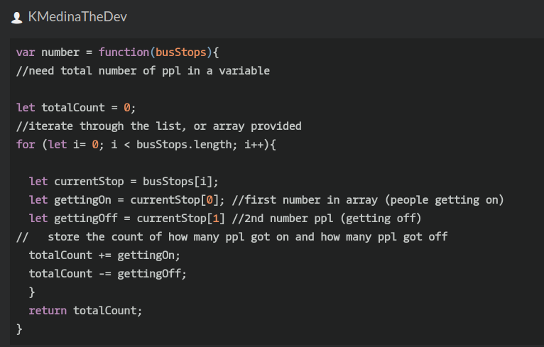

## CodeWars Challenge- 11

*Description:*
Number of people in the bus
There is a bus moving in the city, and it takes and drop some people in each bus stop.

You are provided with a list (or array) of integer arrays (or tuples). Each integer array has two items which represent number of people get into bus (The first item) and number of people get off the bus (The second item) in a bus stop.

Your task is to return number of people who are still in the bus after the last bus station (after the last array). Even though it is the last bus stop, the bus is not empty and some people are still in the bus, and they are probably sleeping there :D

Take a look on the test cases.

Please keep in mind that the test cases ensure that the number of people in the bus is always >= 0. So the return integer can't be negative.

The second value in the first integer array is 0, since the bus is empty in the first bus stop.

*Examples Given:*
 describe("Basic Tests", function(){
1. Test.assertEquals(number([[10,0],[3,5],[5,8]]),5);
2. Test.assertEquals(number([[3,0],[9,1],[4,10],[12,2],[6,1],[7,10]]),17);
3. Test.assertEquals(number([[3,0],[9,1],[4,8],[12,2],[6,1],[7,8]]),21);
4. Test.assertEquals(number([[0,0]]),0);
});

## Languages Used

1. JavaScript

## My solution:

With more practice I realize it is essential to fully understand the problem you are trying to solve. While the instructions may seem clear to some I find it helpful to write them out myself.

In the description this Kata lets us know that we are being provided with an array of integer arrays in which the first number is for the number of people getting on the bus and the second number represents the number of people getting off the bus. These are 2 numbers we need to keep track of, and so I know I need two variables to hold these values. Since I also know an array is being passed in, I know I will need to use a for Loop to iterate through the array.

 The description also explains why the 1st pair of array integers always has a 0 for the second integer, since the bus is empty when it begins the route the 1st array always has a 0 for the second integer, as people are getting on at the first stop, there's no one to get off(...unless the driver does (-.-), but I digress.)

 The variable gettingOn is essentially the integer within the array being passed in at the index position of 0, since this is the number of people getting on. The second variable hold the integer at index position 1, which is the second number in the array, and is the number of people getting off. The problem asks to return the number of people left on the bus. I created a variable that could hold be updated by both the number of people getting on and the number of people getting off each time the loop is made. The loop ends when it has iterated through all the arrays being passed in, at which point the number of people that got On and the number of people that got off have been subtracted from the totalCount, leaving us with how many passengers are left on the bus.
